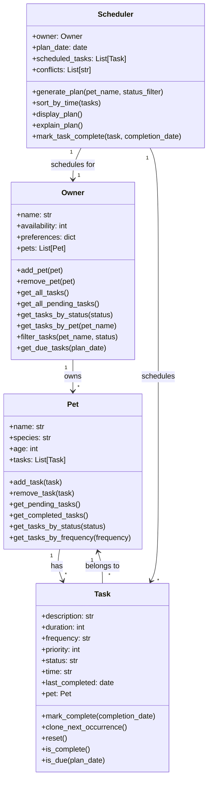

```mermaid
classDiagram
    class Owner {
        +name: str
        +availability: int
        +preferences: dict
        +pets: List[Pet]
        +add_pet(pet)
        +remove_pet(pet)
        +get_all_tasks()
        +get_all_pending_tasks()
        +get_tasks_by_status(status)
        +get_tasks_by_pet(pet_name)
        +filter_tasks(pet_name, status)
        +get_due_tasks(plan_date)
    }

    class Pet {
        +name: str
        +species: str
        +age: int
        +tasks: List[Task]
        +add_task(task)
        +remove_task(task)
        +get_pending_tasks()
        +get_completed_tasks()
        +get_tasks_by_status(status)
        +get_tasks_by_frequency(frequency)
    }

    class Task {
        +description: str
        +duration: int
        +frequency: str
        +priority: int
        +status: str
        +time: str
        +last_completed: date
        +pet: Pet
        +mark_complete(completion_date)
        +clone_next_occurrence()
        +reset()
        +is_complete()
        +is_due(plan_date)
    }

    class Scheduler {
        +owner: Owner
        +plan_date: date
        +scheduled_tasks: List[Task]
        +conflicts: List[str]
        +generate_plan(pet_name, status_filter)
        +sort_by_time(tasks)
        +display_plan()
        +explain_plan()
        +mark_task_complete(task, completion_date)
    }

    Owner "1" --> "*" Pet : owns
    Pet "1" --> "*" Task : has
    Scheduler "1" --> "1" Owner : schedules for
    Scheduler "1" --> "*" Task : schedules
    Task "*" --> "1" Pet : belongs to
```
